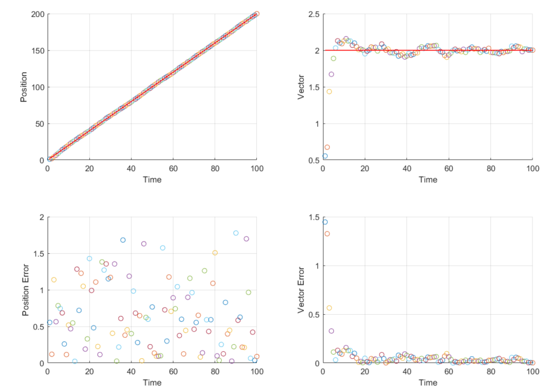
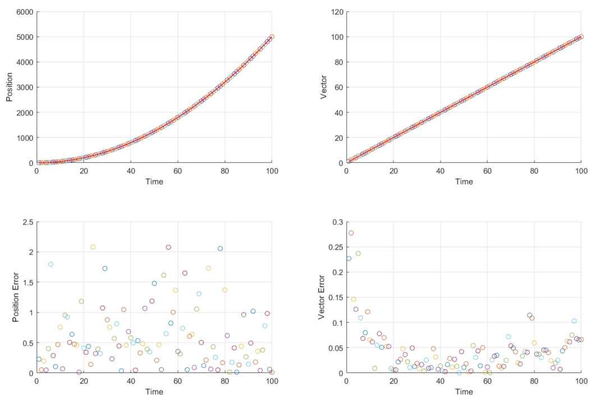
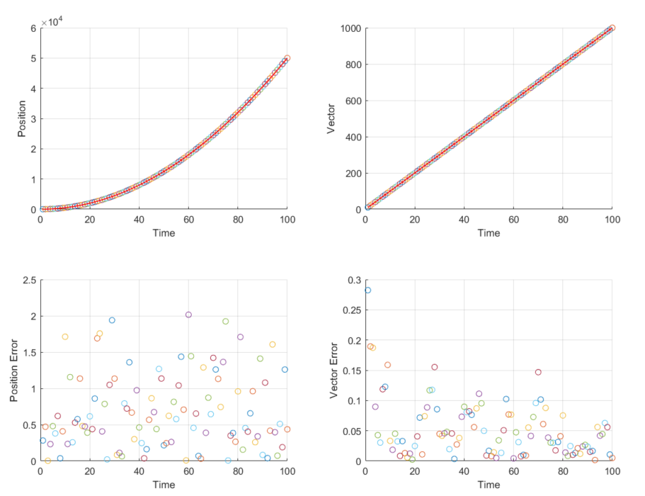

# Five formulas of KF
## Predict 
$\hat{x}^-_k=A\hat{x}_{k-1}+Bu_k$   \
$P^-_k=Ap_{k-1}A^T+Q$
## Correct 
$K_k=P^-_kH^T(HP^-_kH^T+R)^{-1}$    \
$\hat{x}_k=\hat{x}_k^-+k_k(z_k-H\hat{x}_k^-)$   \
$P_k=(I-KH)P_k^-$

## work flow
```
          +----------------+
          |                |
          |                v
      +-------+        +-------+
      |Predict|        |Correct|
      +-------+        +-------+
          ^                |
          |                |
          +----------------+
```

# Matlab Implement KF
```
%卡尔曼滤波(小车[速度,位置]例子)
clc,clear,close all
%% 传感器观测
%--------------------------------------------------------------------------
%Z = H * X + v
%X为t-1时刻实际状态
%Z为t-1时刻实际观测数据
%H为测量系统的参数,即观察矩阵
%v为观测噪声,其协方差矩阵为R
%--------------------------------------------------------------------------
t=(1:100);
ut = 0;%accelertor
v0 = 2;%velocity
Z = v0*t + 1/2 * ut * t.^2;%理想观测值 (汽车的位置,也就是我们要修改的量)
noise=randn(1,100); %在理想观测值上叠加方差为1的高斯噪声
Z=Z+noise;%模拟的实际观测值
H=[1,0];%传感器提供的观测矩阵
R=1;%传感器的观测噪声协方差矩阵
%% 初始状态(均值)和状态协方差
%基于高斯分布建立状态变量需要均值和协方差(即X和P)
X=[0;0]; %初始状态 X=[位置;速度]
P=[1 0;0 1]; %状态协方差矩阵
%% 状态转移矩阵(表示如何由上一状态推测当前状态),它同时作用与X和P来预测下一时刻的X和P
A=[1 1;0 1]; %在速度例题中为[1 delta(t);0 1]
B=[0.5;1];%[delta(t)^2/2, delta(t)]
%% 外部干扰用状态转移协方差矩阵Q表示
Q=[0.001,0;0 , 0.001];
%% 卡尔曼滤波
figure;
hold on;
for i = 1:length(Z) %迭代次数
%% 预测
X_ = A*X + B*ut;%基于上一状态预测当前状态  X_为t时刻状态预测(这里没有控制)
P_ = A*P*A' + Q;%更新协方差  Q系统过程的协方差
%% 计算卡尔曼增益
K = P_*H'/(H*P_*H'+R);
%% 更新
X = X_+K*(Z(i)-H*X_);% 得到当前状态的最优化估算值  增益乘以残差
P = (eye(2)-K*H)*P_;%更新K状态的协方差
%% 绘图
figure(1)
subplot(2,2,1)
set(0,'defaultfigurecolor','w')
scatter(t(i), X(1));
xlabel('Time'),ylabel('Position')
grid on
hold on
subplot(2,2,2)
set(1,'defaultfigurecolor','w')
scatter(t(i), X(2));
xlabel('Time'),ylabel('Vector')
grid on
hold on
subplot(2,2,3)
set(1,'defaultfigurecolor','w')
scatter(t(i), X(1) - Z(i));
xlabel('Time'),ylabel('Position Error')
grid on
hold on
subplot(2,2,4)
set(1,'defaultfigurecolor','w')
scatter(t(i), X(2) - (v0 + ut*t(i)));
xlabel('Time'),ylabel('Vector Error')
grid on
hold on
end
subplot(2,2,1)
plot(v0*t + 1/2 * ut * t.^2, 'r','LineWidth',1)
subplot(2,2,2)
plot(v0 + ut*t, 'r','LineWidth',1)
```

# Result



